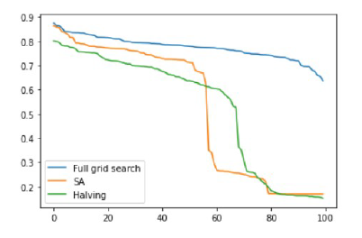
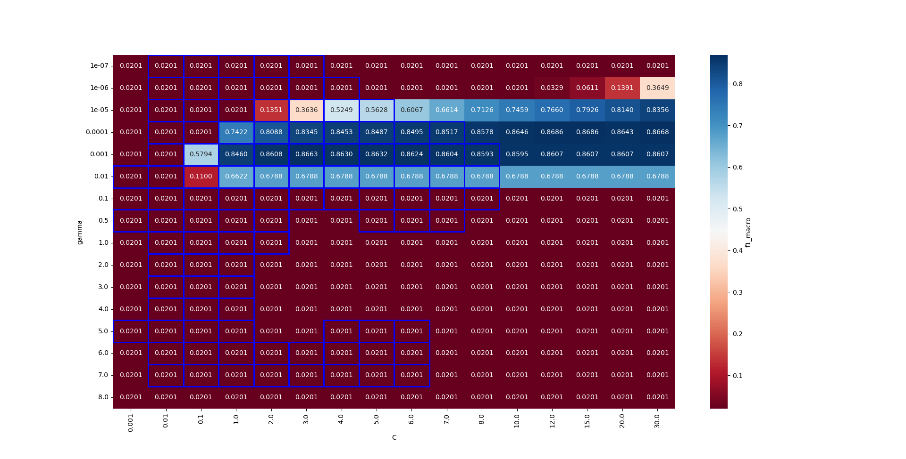

# Simulated annealing hyper-parameter search for an SVM

<h3>This is a simple experimentation with the simulated annealing algorithm for the hyper-parameter tuning of an svm.</h3>

 

<h4>Comparison to other methods. (For 100 runs with random problems)</h4>
 

 

<h4>Cells visited noted in blue rectangles</h4>
